# m5stack-fidgets

English | [繁體中文](README.zh-TW.md)

A collection of small physics toys for the M5Stack Core2: tilt the device for gravity, touch the screen to interact, and collisions come with sound and vibration.

## Games

| # | Name | Preview | How to play |
|---|---|---|---|
| 1 | Marbles | 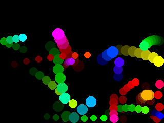 | Balls collide and leave trails; tilt to roll them, move a finger close to push them away, shake to scatter them all |
| 2 | Pinball | 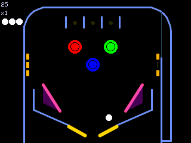 | Tap the screen or press A / C to launch; A / hold the left half for the left flipper, C / hold the right half for the right flipper, tilt to nudge; hit the lanes and drop targets to score, 3 balls, highest score wins |
| 3 | Tic-Tac-Toe | 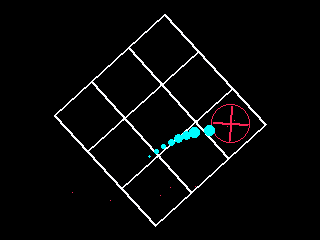 | A ball bounces in a rotating box, and every so often an O / X is placed in the empty cell nearest the ball; tap to kick the ball, A/C to spin the box faster |
| 4 | Slicer | 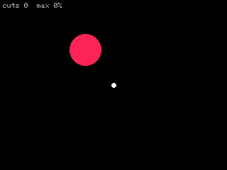 | Tap once at the start to place a cutter; tumbling shapes that sweep across it are sliced in two and keep growing; shake to scatter them all; count how many cuts you get |
| 5 | Ball Overflow | 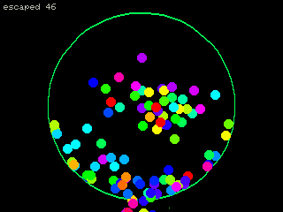 | Every ball that escapes through the gap spawns 3 more, until the arena is packed; A/C to rotate the gap, tap to push nearby balls away, shake to scatter them all |
| 6 | Shape Merge | 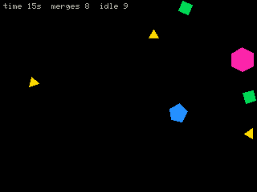 | Falling polygons that touch an identical one merge into a shape with one more side, and two circles merge into a bigger triangle; tap to bounce nearby shapes away, shake to scatter them all; the game ends if nothing merges for too long, so see how long you last |
| 7 | Balloons and Spikes | 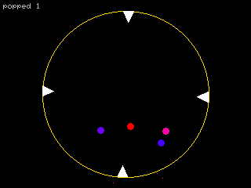 | Balloons grow with every bounce and pop when they hit a spike, splitting into two; A/C to rotate the spikes, tap to spawn a balloon, shake to scatter them all |
| 8 | Three-Color Absorb | 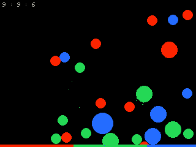 | When two balls of different colors collide, both turn into the third color, and a ball touching several at once absorbs them and grows; tap to bounce nearby balls away, shake to scatter them all; the game ends when everything is one color |
| 9 | String Art | 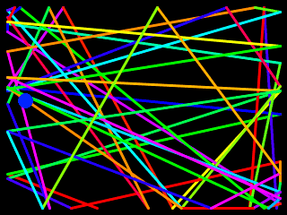 | Each time the ball hits a wall, a colored line is drawn from the previous hit point, layering up into string art; tap to kick the ball, shake to scatter it, A / C to switch between auto colors and a fixed color |
| 10 | Ring Escape | 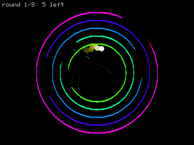 | The ball escapes from the center through the gaps in each ring and speeds up after every ring; tilt to steer the ball, tap to kick it, A/C to spin all the rings |
| 11 | Beat Hop | 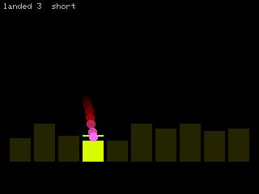 | A ball hops across piano keys and plays a note on every landing; tilt right to speed up the tempo and left to slow it down, tap to make the next note hop higher |
| 12 | Shrinking Pentagon | 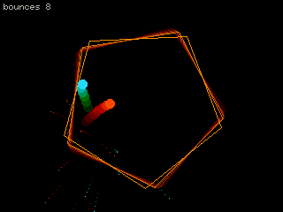 | Two balls bounce inside a spinning pentagon that keeps shrinking; tap to kick the balls, A/C to spin the pentagon; it bursts and restarts when it gets too small |
| 13 | Territory War | 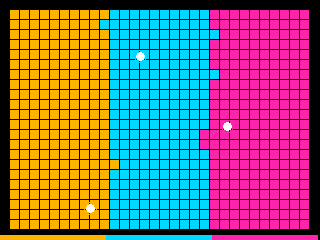 | Each of three colors has a ball, and every cell of another color it hits is painted its own color; tilt to bias the balls, tap to kick the nearest one; the round restarts when one color takes the whole board |
| 14 | Ring Breaker | 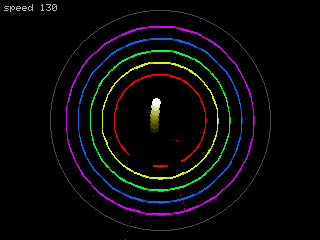 | The ball smashes concentric brick rings block by block and speeds up whenever a ring is cleared; tilt to steer the ball, tap to kick it, A/C to spin the rings |
| 15 | Stickman Swing | 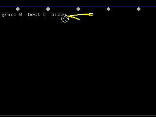 | Tilt to pump the swing, tap to let go and fly toward the next anchor, and the hand grabs it automatically when close; fall to the ground and start over, counting how many anchors you catch in a row |
| 16 | Dino Run | 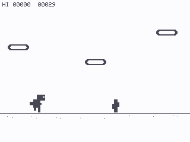 | Tap or press A to jump over cacti, hold the lower half or press C to duck under pterodactyls, tilt left to slow down a little; it keeps getting faster, and a hit ends the run |
| 17 | Seed vs. the Press | 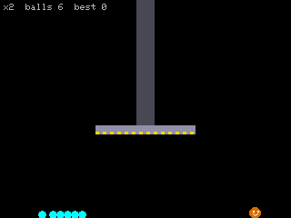 | You are Seed: tilt to move, tap to jump, and dodge the press that slams down at intervals; balls caught under it multiply and pack the box fuller and fuller |
| 18 | Color Merge Race | 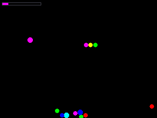 | Small balls keep dropping from the top, and same-colored balls merge and grow when they touch; the first color to reach the target size wins; tap to drop 3 balls at your finger, shake to scatter them all |
| 19 | One Bounce, One Ball | 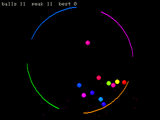 | Every time a ball hits a spinning arc it spawns another, and balls that pass through a gap fly away; tilt or A/C to control the ring's speed and direction, tap to drop a ball; the game ends when the count stops growing, so aim for the highest count |
| 20 | Marble Machine | 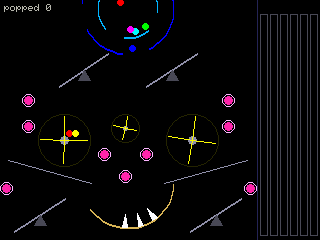 | Marbles run through spinning rings, seesaws, paddle wheels and bumpers into a spiked bowl at the bottom, then stack by color in the tubes on the right; no winning or losing; A / C to turn every mechanism at once, tap one end of a seesaw to press it down, hold a paddle wheel to drive it with a motor, tilt to push sideways, tap to push nearby marbles away |
| 21 | Penalty Kick | 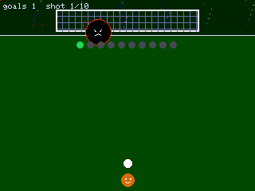 | Tilt to aim, tap to shoot; the goalkeeper grows after every goal you score; 10 shots, most goals wins |
| 22 | Dig Down | 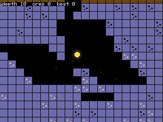 | The ball smashes its way down through blocks of rock, through caves and ore layers; tilt to nudge it, tap to slam down; the run ends when it reaches the lava at the bottom, so see how deep you get |
| 23 | Physics Blocks | 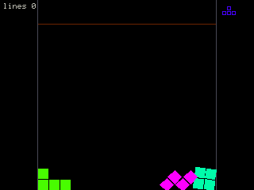 | Tetris shapes as real rigid bodies that tip and tilt; tilt to push them sideways, tap to rotate; full rows are cleared, and the game ends when the stack reaches the top |
| 24 | Guess the Tower | 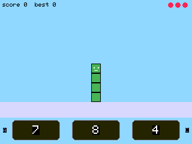 | Guess the number shown by a Numberblocks tower from three choices; A picks left, C picks right, tap the middle for the middle one; three mistakes and it's over |
| 25 | Build the Number | 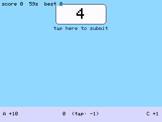 | A adds a ten, C adds a one, tap the tower to remove one; once it matches the target, tap the target to submit; see how many you can build before time runs out |
| 26 | Compare and Add | 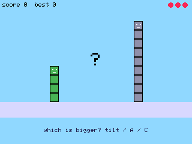 | Two towers: for "which is bigger", tilt toward the bigger one (or A for left, C for right); for "what's the sum", pick one of three answers; three mistakes and it's over |
| 27 | Math Runner | 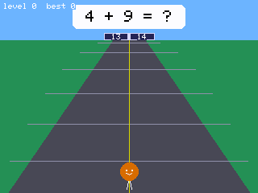 | Keep running forward; each gate shows two answers, one on each side, so tilt / press A / C / tap the left or right half to move to the correct side; questions get harder, and a wrong gate ends the run |
| 28 | Dungeon Knight | 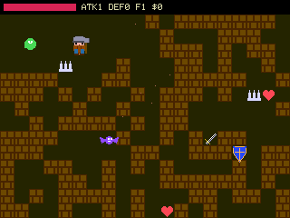 | The knight travels in straight lines like a billiard ball, bouncing off walls and smashing bricks; tilt or A/C to steer, and the sword swings automatically near the boss; collect hearts / swords / shields, avoid traps, clear the minions, then defeat the boss to reach the next floor |
| 29 | Marble Heroes Battle | 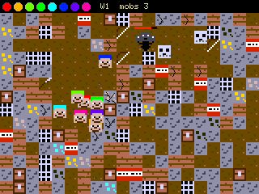 | 8 colored hero marbles take on a horde of monsters and a boss, both sides digging through blocks; tilt or A/C to steer, tap to send every hero charging at your finger, break chests for swords / bows / spears; survive as many waves as you can |
| 30 | Red Light, Green Light | 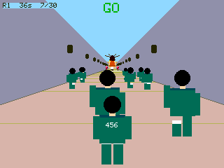 | Alternate A (left foot) and C (right foot) to walk forward, and pressing the same foot twice makes you stumble; if you press a button, are still finishing a step, or move the device while the doll is looking, you get shot; reach the finish line in time to advance |
| 31 | Battle Tops | 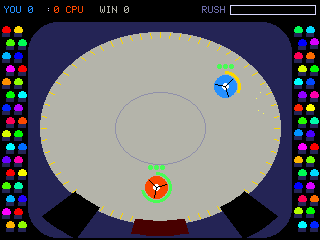 | Tap to stop the power bar and set your launch spin; tilt to push your top, tap to charge at your finger, press A or C for a whirlwind dash when the energy is full; score by spinning out, bursting, or knocking the opponent into a pocket, first to 4 points wins the match |
| 32 | Rush Hour | 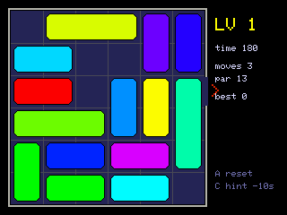 | Drag the cars so the red car can exit on the right; A restarts the level, C shows a hint move (costs time); solve as many levels as you can before time runs out |
| 33 | Road Racer | 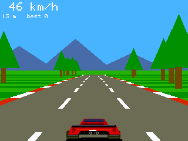 | The car accelerates on its own; tilt or A / C to steer, hold the screen to brake, and corners push you outward; weave through traffic, and a crash ends the run |
| 34 | Gears | 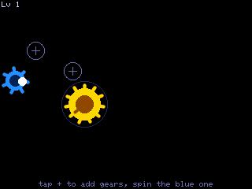 | Tap a "+" slot to cycle its gear (small / medium / large / empty) and connect the blue drive gear to the gold target gear; draw circles with a finger or use A / C to turn the blue gear, and two full turns of the target clears the level; gears that overlap or form a closed loop jam, and some slots must be left empty |
| 35 | Garage | 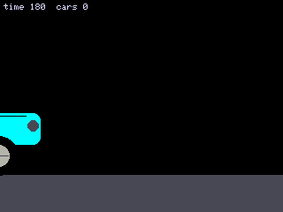 | Each car arrives with a few faults; tap a part to fix it: inflate or change a tire by removing the lug nuts, add fuel, attach the battery clamps, replace a headlight bulb, hammer out dents, wipe off mud; A returns to the overview, C starts a test drive, and anything left unfixed shows up on the road; fix as many cars as you can before time runs out |

## Controls

Three touch buttons below the screen:

- Menu: A / C or swipe left / right to change games, B or tap the preview to enter (entering resets the game); it auto-cycles after 10 seconds of inactivity; below each card is how many times that game has been played (stored in NVS, keyed by game name)
- In game: what A / C do is listed in the table, and where it isn't, they act as a virtual tilt left / right; tilt means gravity unless the table says otherwise (Guess the Tower, Build the Number, Red Light, Green Light, Rush Hour, and Gears ignore tilt)
- **Long-press B in a game to return to the menu**; double-click B to reset the game. A short press of B does nothing; B only counts in the middle 70 px of the button area, and presses near the edges count as brushing A / C

## Build

Requires the [PlatformIO](https://platformio.org/) CLI. With the Core2 connected over USB, run this in the project root:

```
pio run -t upload
```

This compiles the firmware and flashes it to the Core2 (the serial port is detected automatically). The first run downloads the ESP32 toolchain and the M5Unified library specified in `platformio.ini`, so it takes a while. To compile without flashing, use `pio run`.

If the tilt direction or sensitivity is off, see the calibration constants at the top of `src/common.h`.

## Layout

- `src/main.cpp`: menu and main loop; the order of `games[]` is the menu numbering. When adding or removing a game, update the tables in both READMEs (`README.md` in English, `README.zh-TW.md` in Chinese); file header comments and code don't hold the numbers
- `src/<key>.h`: one file per game, named after its `games[]` key; the header comment describes gameplay and controls
- `src/common.h`: shared by all games (canvas, Ctx, colors, vibration, sound, calibration constants)
- `src/ringlib.h`, `numberlib.h`, `marblelib.h`, `face.h`, `ragdoll.h`: shared helpers for the ring games, the Numberblocks games, the marble machine, and the stickman
- `src/jamgen.h`, `gearsim.h`: level generation for Rush Hour and Gears, independent of M5, so they can be checked on a host with `test/` (commands in the file headers)
- `tools/capture/`: records every game to `previews/<key>.gif` on a computer; `tools/capture/run.sh` records them all, and passing keys records only those (requirements in the file header)
