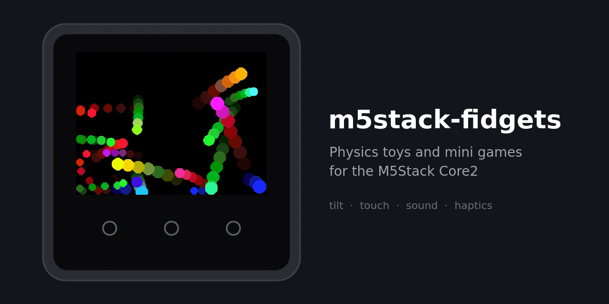

# m5stack-fidgets

[English](README.md) | 繁體中文

M5Stack Core2 上的物理模擬小玩具合集:傾斜裝置給重力、點螢幕互動,撞擊有聲音與震動。



## 遊戲

| # | 名稱 | 畫面 | 玩法 |
|---|---|---|---|
| 1 | 彈珠 |  | 球互撞、留下殘影;傾斜讓球滾動、手指靠近把球推開、搖一下全部散開 |
| 2 | 彈珠檯 |  | 點螢幕或 A / C 發射;A / 按住左半揮左擋板、C / 按住右半揮右擋板,傾斜輕推;打燈道、倒靶得分,3 顆球比分數 |
| 3 | 井字 |  | 球在旋轉的箱子裡彈,定時在離球最近的空格蓋 O / X;點螢幕踢球、A/C 加速轉箱子 |
| 4 | 切割 |  | 開局點一下放切割點,翻滾的圖塊掃過它就被切成兩片、越長越大;搖一下全部噴開;比切了幾刀 |
| 5 | 圓球溢出 |  | 球從缺口逃出就生 3 顆,直到塞滿;A/C 轉缺口、點螢幕推開附近的球、搖一下全部噴開 |
| 6 | 合成圓 |  | 掉下的多邊形碰到同形狀的就合成多一邊的,兩個圓再合成更大的三角形;點螢幕彈飛附近的、搖一下全部噴開;太久沒合成就結束,比撐多久 |
| 7 | 氣球與尖刺 |  | 氣球每彈一次就變大,碰到尖刺破掉、生兩個;A/C 轉尖刺、點螢幕生一顆氣球、搖一下全部噴開 |
| 8 | 三色吞食 |  | 兩顆不同色相撞一起變成第三色,同時撞到多顆就吞掉變大;點螢幕彈飛附近的、搖一下全部噴開;全部同色就結束 |
| 9 | 彩色連線 |  | 球每撞一次牆,就從上一個撞點畫一條彩色線過來,越疊越滿;點螢幕踢球、搖一下噴開、A / C 切換自動換色或固定顏色 |
| 10 | 逃脫加速 |  | 球從中心穿過各環缺口往外逃,每逃出一環就加速;傾斜改變球的方向、點螢幕踢球、A/C 轉整組環 |
| 11 | 踩拍子 |  | 球在琴鍵上一格格跳,每次落地彈一個音;往右傾拍子變快、往左變慢,點螢幕讓下一個音跳得更高 |
| 12 | 收縮五角形 |  | 兩顆球在一直縮小的旋轉五角形裡彈跳;點螢幕踢球、A/C 轉五角形;縮到太小就炸開重來 |
| 13 | 三色領土戰 |  | 三色各一顆球,撞到別色格子就染成自己的顏色;傾斜讓球偏向、點螢幕踢最近的球;一色佔滿全盤就重來 |
| 14 | 打碎環 |  | 球把同心磚環一塊塊打碎,清空一環就加速;傾斜改變球的方向、點螢幕踢球、A/C 轉磚環 |
| 15 | 火柴人盪繩 |  | 傾斜加力盪起來,點螢幕放手飛向下一個錨點,手靠近就自動抓住;掉到地上重來,比連續抓幾個 |
| 16 | 小恐龍 |  | 點螢幕或 A 跳過仙人掌、按住下半部或 C 蹲過翼龍,往左傾稍微減速;越跑越快,撞到就結束 |
| 17 | 壓板與 Seed |  | 你是 Seed:傾斜移動、點螢幕跳,躲開定時壓下的壓板;被壓到的球會增殖,把箱子越塞越滿 |
| 18 | 同色合併競賽 |  | 頂端不斷丟小球,同色碰到就合併變大,先長到門檻的顏色贏;點螢幕在手指處丟 3 顆、搖一下全部噴開 |
| 19 | 每彈一次生一顆 |  | 球撞到旋轉的弧就多生一顆,穿過缺口就飛走;傾斜或 A/C 控制環的轉速與方向、點螢幕丟一顆;球數不再增加就結束,比最高球數 |
| 20 | 彈珠機關 |  | 彈珠一路穿過轉環、蹺蹺板、槳輪、彈跳柱,落進底部的尖刺碗,再依顏色堆進右邊的管子,沒有輸贏;A / C 讓全部機關一起轉、點蹺蹺板一端把它壓下、按住槳輪用馬達轉,傾斜左右推、點螢幕推開附近的彈珠 |
| 21 | 罰球 |  | 傾斜瞄準、點螢幕射門,守門員每失一球就變大;10 球比進球數 |
| 22 | 每彈一次挖一塊 |  | 球一路往下敲掉地層方塊,穿過洞穴與礦層;傾斜輕推、點螢幕往下砸;碰到底部岩漿結束,比挖多深 |
| 23 | 物理方塊堆 |  | 會翻、會歪的真剛體俄羅斯方塊;傾斜左右推、點螢幕旋轉;填滿一列就消掉,堆到頂結束 |
| 24 | 看塔猜數 |  | 看 Numberblocks 的塔猜是幾,三選一;A 選左、C 選右、點中間選中間;錯 3 次結束 |
| 25 | 湊出這個數 |  | A 加一根 10、C 加 1、點塔減 1,疊到跟目標一樣再點目標送出;限時比湊對幾題 |
| 26 | 比大小與加法 |  | 兩座塔:「哪邊大」往大的那邊傾斜(或 A 左 C 右)作答,「加起來多少」三選一;錯 3 次結束 |
| 27 | 算數跑酷 |  | 一直往前跑,門的左右兩格是兩個答案,傾斜 / A / C / 點左右半邊移到對的那邊;題目越來越難,走錯就結束 |
| 28 | 地城勇者 |  | 勇者像撞球一樣直線反彈、撞碎磚牆;傾斜或 A/C 轉向,靠近 Boss 自動揮劍;撿愛心 / 劍 / 盾、避開陷阱,清光小怪後打倒 Boss 進下一層 |
| 29 | 彈珠勇者大戰 |  | 8 色勇者彈珠對上一批怪與 Boss,雙方一路敲穿方塊;傾斜或 A/C 轉向、點螢幕全部朝手指衝,敲開寶箱拿劍 / 弓 / 長矛;撐過越多波越好 |
| 30 | 一二三木頭人 |  | A 左腳、C 右腳交替按往前走,同一腳連按會絆一下;娃娃轉頭時按鍵、腳還沒收或機器在晃就被開槍;限時走到終點進下一關 |
| 31 | 戰鬥陀螺 |  | 點螢幕停住力量條決定發射轉速;傾斜推自己的陀螺、點螢幕朝手指衝撞、能量滿按 A 或 C 放旋風衝刺;把對手轉停、撞爆或打進口袋得分,先到 4 分贏一場 |
| 32 | 塞車 |  | Rush Hour:拖動車子讓紅車從右邊出口出去;A 重來這關、C 提示一步(扣時間);限時解越多關越好 |
| 33 | 公路賽車 |  | 自動加速,傾斜或 A / C 轉向、按住螢幕煞車,過彎會被甩向外側;閃過車流,撞到就結束 |
| 34 | 齒輪 |  | 點「+」空位換齒輪(小 / 中 / 大 / 空),把藍色驅動輪接到金色目標輪;手指畫圈或 A / C 轉藍輪,目標輪轉滿兩圈過關;齒輪疊在一起或繞成一圈會卡死,有些空位要留空 |
| 35 | 修車廠 |  | 每台車帶幾個故障,點零件進去修:輪胎打氣或拆螺帽換胎、倒油、接電瓶夾子、換大燈燈泡、敲平凹痕、擦掉泥巴;A 回全景、C 試車,沒修好的試車會出狀況;限時比修好幾台 |

## 操作

螢幕下方三個觸控鍵:

- 選單:A / C 或左右滑換遊戲,B 或點預覽進入(進入時遊戲重置);10 秒沒操作自動輪播;卡片下方顯示該遊戲進入過幾次(存 NVS,以遊戲名為 key)
- 遊戲內:A / C 的用途寫在表格,表格沒寫的就是往左 / 往右的虛擬傾斜;傾斜表格沒另外寫的就是重力(看塔猜數、湊出這個數、一二三木頭人、塞車、齒輪不吃傾斜)
- **遊戲中長按 B 回選單**;雙擊 B 重置這個遊戲。短按 B 不做事;B 只認鍵區正中 70 px,靠邊的算按 A / C 擦到

## 建置

只想玩的話,用 <https://8loser.github.io/m5stack-fidgets/> 從瀏覽器直接燒錄(桌面版 Chrome / Edge,不用裝任何東西)。自己建置:

需要 [PlatformIO](https://platformio.org/) CLI。Core2 用 USB 線接上電腦後,在專案根目錄執行:

```
pio run -t upload
```

這會編譯韌體並燒進 Core2(序列埠自動偵測)。第一次執行會先下載 ESP32 工具鏈與 `platformio.ini` 指定的 M5Unified,要等一陣子。只編譯不燒錄用 `pio run`。

傾斜方向或靈敏度不對:見 `src/common.h` 頂部的校正常數。

## 結構

- `src/main.cpp`:選單與主迴圈,`games[]` 的順序就是選單編號;增刪遊戲要同步改兩份 README 的表格(`README.md` 英文、`README.zh-TW.md` 中文;檔頭註解與程式不寫編號)
- `src/<key>.h`:各遊戲一個檔,檔名就是 `games[]` 的 key,檔頭註解寫了玩法與操作
- `src/common.h`:所有遊戲共用(畫布、Ctx、顏色、震動、音效、校正常數)
- `src/ringlib.h`、`numberlib.h`、`marblelib.h`、`face.h`、`ragdoll.h`:環系列、Numberblocks 系列、彈珠機關、火柴人的共用函式
- `src/jamgen.h`、`gearsim.h`:塞車與齒輪的關卡產生,不依賴 M5,可在主機上用 `test/` 核對(指令在檔頭)
- `tools/capture/`:在電腦上把每個遊戲錄成 `previews/<key>.gif`,`tools/capture/run.sh` 錄全部、加 key 只錄指定的(需求在檔頭)
